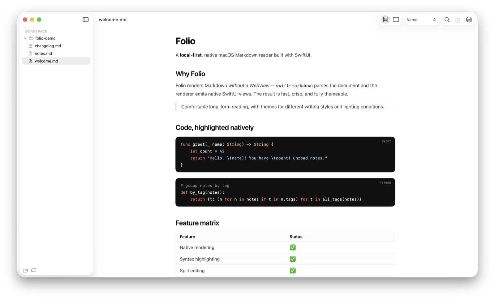
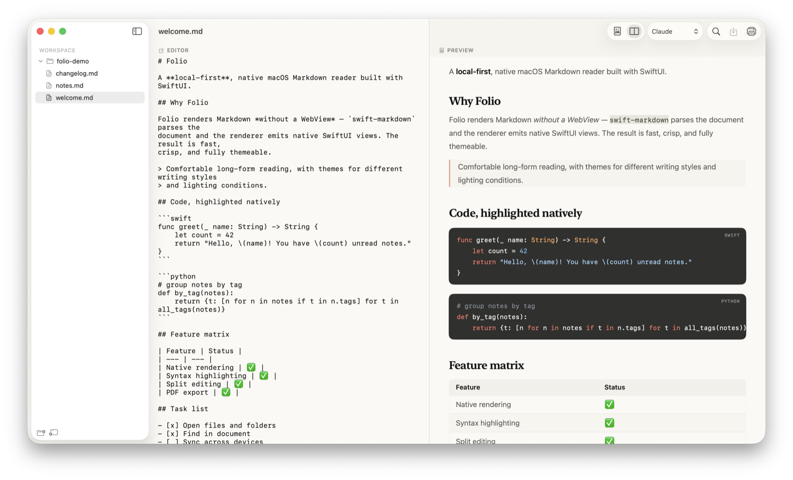
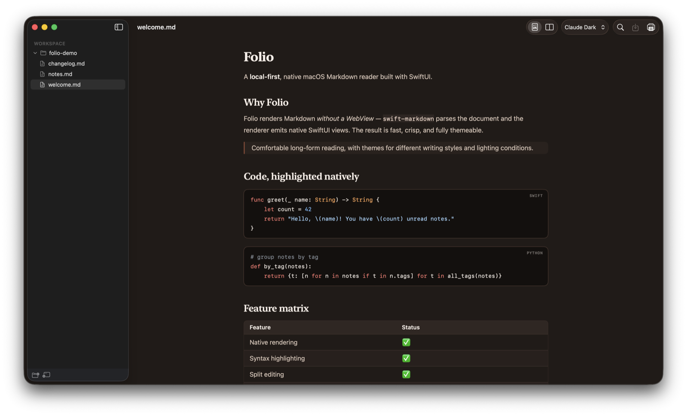
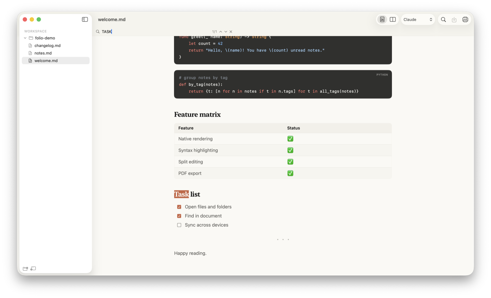

# Folio

[English](README.md) | [简体中文](README.zh-CN.md) | [日本語](README.ja.md)

Folio はローカルファースト設計のネイティブ macOS Markdown ビューア兼軽量
エディタです。完全に SwiftUI で構築され、WebView を使わずに Markdown を
描画します。[swift-markdown](https://github.com/apple/swift-markdown) が
GitHub Flavored Markdown を解析し、レンダラがネイティブの SwiftUI ビューと
`AttributedString` を生成します。さまざまな文章スタイルや照明環境に合わせた
複数のテーマを備え、長文を快適に読むことに重点を置いています。

Folio は現行アプリで、macOS 専用です。最初のクロスプラットフォーム実装
（**PreviewerMD** という React + Tauri アプリ）は本リポジトリの
[`Previewer.md/`](#旧バージョンpreviewermdtauri) に残っています。

## スクリーンショット





| Claude Dark テーマ | ドキュメント内検索 |
| --- | --- |
|  |  |

## 機能

- 個別の Markdown ファイルを開く、またはフォルダ単位で閲覧。
- ピン留め・最近使ったワークスペースフォルダに対応したネイティブの
  サイドバーファイルツリー。
- GitHub Flavored Markdown の描画——見出し、リスト、タスクリスト、表、
  引用、打ち消し線、リンク、フェンス付きコードブロック。
- コードブロックのネイティブ構文ハイライト（約 30 言語、highlight.js 不使用）。
- プレビューと分割（エディタ／プレビュー）モードの切り替え。編集はディスクへ保存。
- ドキュメント内検索（⌘F）。ハイライトと折り返しジャンプに対応。
- ネイティブの印刷パイプラインによる印刷・PDF 書き出し（⌘P）。
- 複数のワークスペースウィンドウ。各ウィンドウが独自の文書とテーマを持つ。
- Finder から `.md`/`.markdown` ファイルを直接開く（ファイル関連付け）。
- 複数の読書テーマ——Vercel（既定）、Claude、Claude Dark、Lovable、Spotify、
  Dark、High Contrast。暖色系の編集向けテーマは見出しにセリフ体を使用。
- ウィンドウの位置とサイズは再起動後も復元。

## 動作要件

- macOS 15 以降
- Swift 6 ツールチェーン（Xcode 16 または対応するコマンドラインツール）

## ビルドと実行

```bash
cd Folio
swift build          # コンパイル
swift test           # テスト実行
swift run            # ウェルカム文書で起動
```

配布用の app バンドルを生成（アイコン・ファイル関連付け付き、アドホック署名）：

```bash
cd Folio
./scripts/bundle.sh        # → dist/Folio.app
./scripts/bundle.sh --dmg  # → dist/Folio.dmg も生成
```

インストール：`cp -R dist/Folio.app /Applications/`。

開発用の補助スイッチ（バンドル不要、実行ファイルを直接起動）：

```bash
FOLIO_OPEN=~/notes swift run            # 起動時にフォルダ/ファイルを開く
FOLIO_THEME=claude swift run            # 読書テーマを指定
FOLIO_EXPORT_PDF=/tmp/doc.pdf swift run # 画面なしで PDF に印刷描画
```

## リポジトリ構成

| パス | 用途 |
| --- | --- |
| `Folio/` | ネイティブ macOS SwiftUI アプリ（現行）。 |
| `Previewer.md/` | 最初の React + Tauri アプリ **PreviewerMD**（クロスプラットフォーム）。 |
| `src/` | 初期のブラウザ専用 Markdown プレビュー試作。 |
| `docs/` | 設計メモと実装記録。 |

`Folio/` 内の Swift モジュールは、Tauri 版の TypeScript モジュールの挙動と
ほぼ一対一で対応しています（それぞれにテストあり）。ファイル単位の対応表と
マイルストーンの履歴は [`Folio/README.md`](Folio/README.md) を参照してください。

## 旧バージョン：PreviewerMD（Tauri）

クロスプラットフォームの React + TypeScript + Vite + Tauri アプリは、macOS・
Windows・Linux で引き続き利用できます。

```bash
cd Previewer.md
npm install
npm run tauri -- dev     # 開発
npm run tauri -- build   # パッケージ化
```

レンダラ側のコードは `Previewer.md/src/`、ネイティブコマンドと Tauri 設定は
`Previewer.md/src-tauri/` にあります。

## セキュリティとプライバシー

- Folio はローカルファーストで、ユーザーが選択したファイルのみを扱います。
- 署名証明書、プロビジョニングプロファイル、生成されたアーカイブ、
  プラットフォーム固有のビルド成果物はコミットしないでください。

## コントリビュート

Issue と Pull Request を歓迎します。コード変更にはできる限り焦点を絞った
テストを添え、PR を作成する前に `swift test`（Tauri 版は独自のチェック）を
実行してください。

## ライセンス

本プロジェクトは MIT ライセンスです。[LICENSE](LICENSE) を参照してください。
