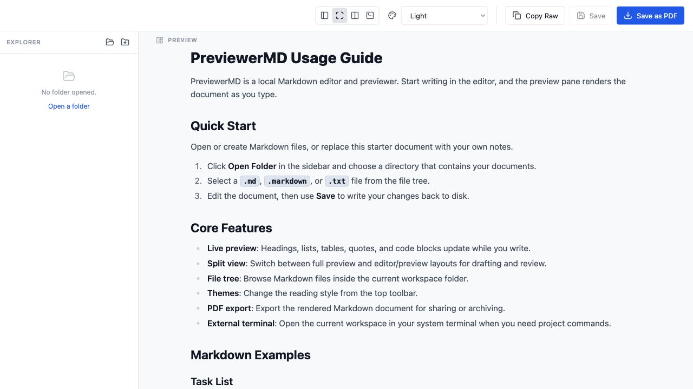
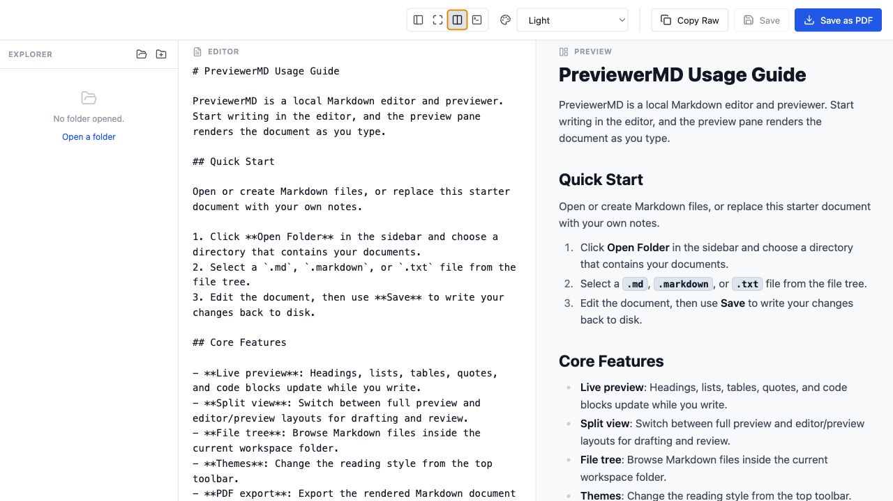
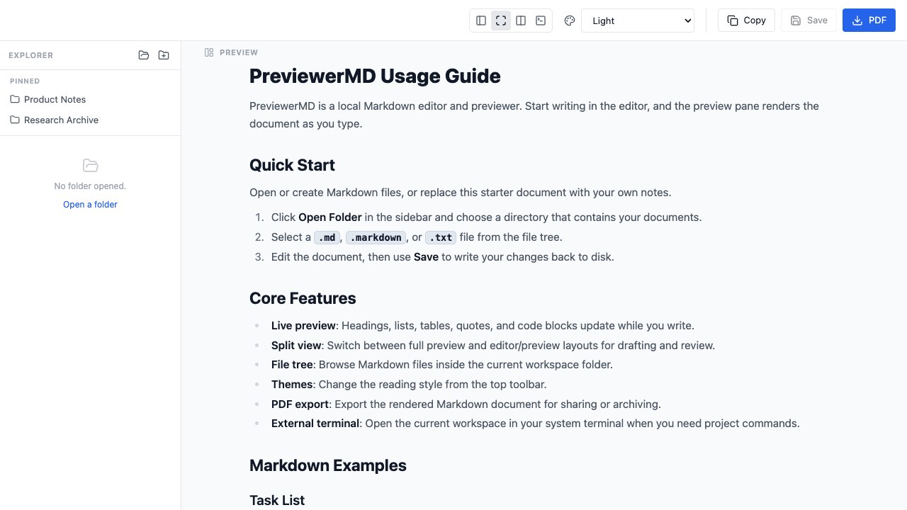
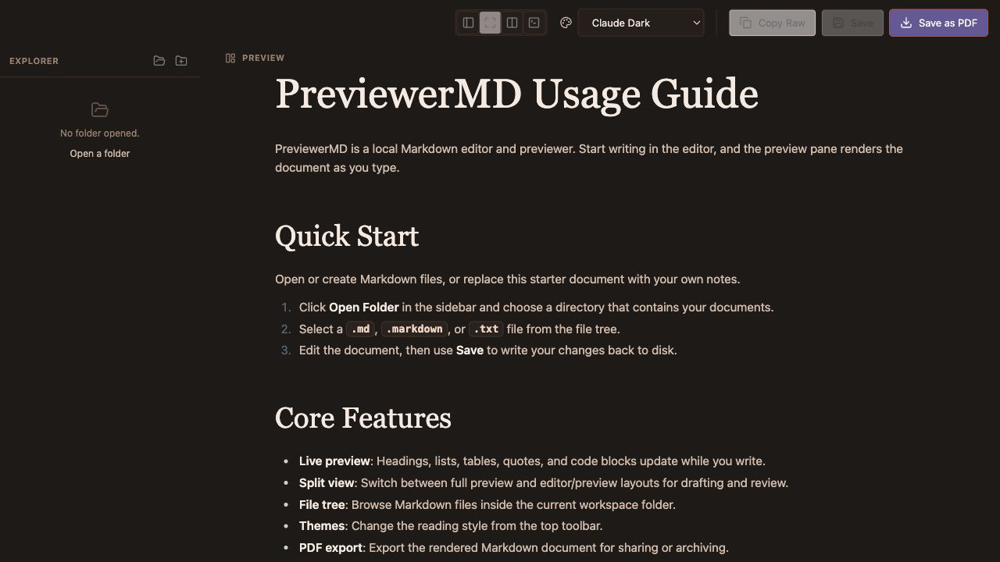
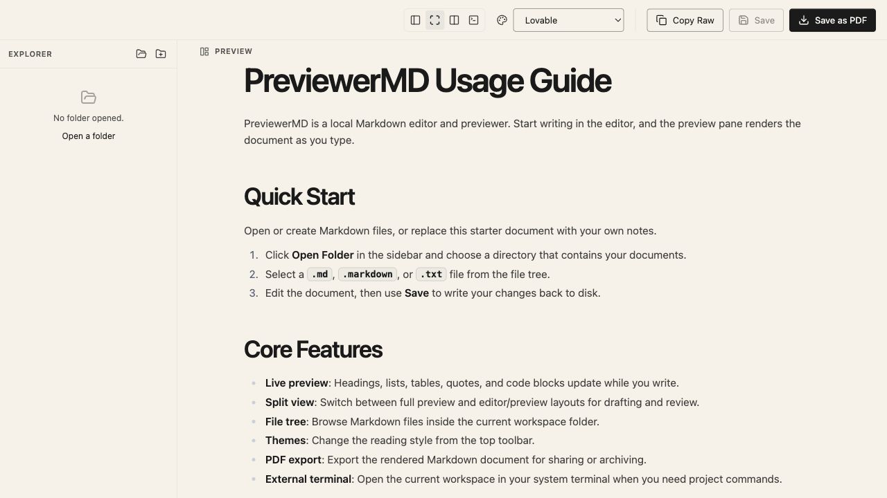
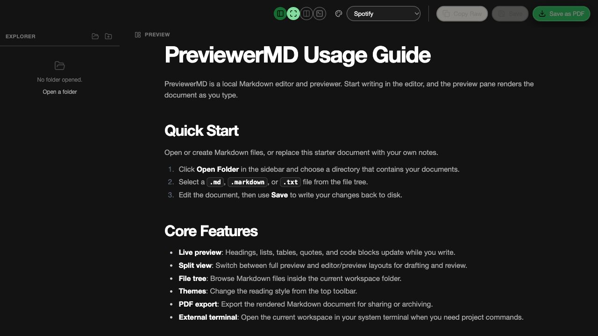

# PreviewerMD

[English](README.md) | [简体中文](README.zh-CN.md) | [日本語](README.ja.md)

PreviewerMD 是一个本地优先的 Markdown 阅读器和轻量编辑器，基于 React、
TypeScript、Vite 和 Tauri 构建。它重点优化长文阅读体验，提供多套适合
不同写作风格、光线环境和夜间使用的视觉主题。本文档聚焦桌面版应用。

## 截图







### 主题展示

PreviewerMD 内置多套面向阅读的主题，从清爽浅色、柔和编辑风，到夜间深色和
高对比风格都可以覆盖。主题可以从顶部工具栏切换，并会作用于整个阅读界面，
不只是正文区域。







## 项目状态

PreviewerMD 已可用于本地开发和打包。当前发布目标是桌面版应用。

## 仓库结构

| 路径 | 用途 |
| --- | --- |
| `Previewer.md/` | 面向 macOS、Windows 和 Linux 的 Tauri 桌面应用。 |
| `src/` | 早期浏览器版 Markdown previewer 原型。 |
| `docs/` | 规划说明和实现记录。 |

## 功能

- 打开单个 Markdown 文件，或浏览包含 Markdown 文档的文件夹。
- 将常用工作区文件夹固定到侧栏，并从原生 File 菜单重新打开最近使用的文件夹。
- 渲染 GitHub Flavored Markdown，并支持代码块语法高亮。
- 在完整预览和编辑/预览分栏模式之间切换。
- 将确认后的编辑保存回磁盘。
- 在当前文档内搜索。
- 打印或导出渲染后的 Markdown。
- 从多套阅读主题中选择，包括浅色、深色、编辑风和高对比风格，适应不同使用环境。
- 保留接近原生桌面应用的窗口行为和主题选择。
- 在系统终端中打开当前文件夹。

## 环境要求

- Node.js 20 或更新版本
- npm 10 或更新版本
- Rust stable toolchain
- 当前操作系统对应的 Tauri 2 平台依赖

运行桌面应用前，请先按官方 Tauri prerequisites 完成对应系统的环境配置。

## 桌面版开发

```bash
cd Previewer.md
npm install
npm run tauri -- dev
```

常用命令：

```bash
npm test
npm run build
npm run perf:gate
cargo test --manifest-path src-tauri/Cargo.toml
npm run tauri -- build
```

渲染进程应用代码位于 `Previewer.md/src/`。Tauri 配置和原生命令位于
`Previewer.md/src-tauri/`。

## 旧版 Web 原型

仓库根目录保留了一个早期浏览器版 previewer。它仍可通过以下命令运行：

```bash
npm install
npm run dev
```

该原型与正式的 Tauri 桌面应用相互独立。

## 发布前验证

发布或打 tag 前，建议先运行桌面版检查：

```bash
cd Previewer.md
npm test
npm run build
npm run perf:gate
cargo test --manifest-path src-tauri/Cargo.toml
```

随后对打包后的应用做手动 smoke test：

- 打开一个 Markdown 文件和一个文件夹。
- 从文件树固定一个文件夹，通过 Pinned 区域重新打开，然后取消固定。
- 打开多个文件夹，确认 `File > Recent Folders` 可以重新打开它们，并确认
  `Clear Recent Folders` 会清空最近列表但不会删除固定文件夹。
- 调整窗口大小和位置，退出后重新打开。
- 在 macOS 使用 `Cmd+F`，在 Windows/Linux 使用 `Ctrl+F` 搜索文档。
- 切换编辑模式，并确认保存行为符合预期。
- 打印或导出当前文档。
- 在系统终端中打开当前文件夹。

## 安全与隐私

- PreviewerMD 是本地优先应用，只处理用户主动选择的文件。
- 不要提交真实 `.env` 文件、签名证书、provisioning profile、生成的归档包或平台构建产物。
- `.env.example` 只包含占位值。
- 公开发布前，请轮换任何曾在本地实验中使用过的签名材料。

## 贡献

欢迎提交 issue 和 pull request。提交代码改动时，请在可行范围内补充聚焦的测试，
并在开启 pull request 前运行相关验证命令。

## 许可证

本项目使用 MIT License。详见 [LICENSE](LICENSE)。
